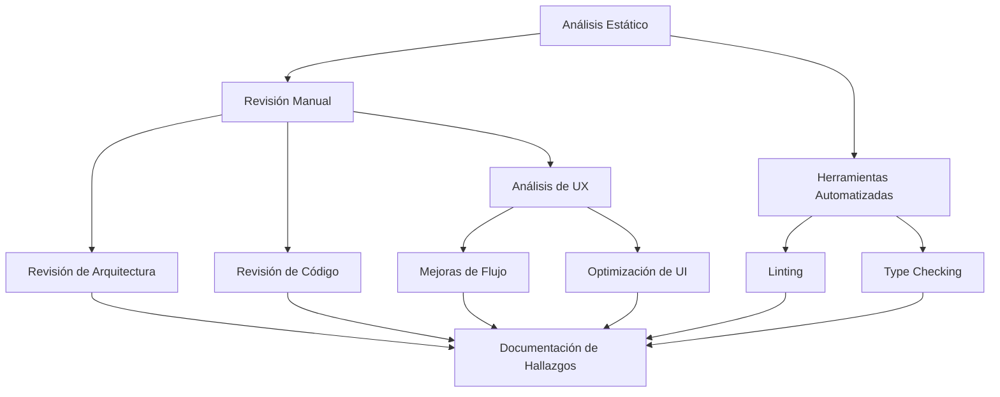

# Plan de Análisis de Código - Genre Detector App

## 1. Alcance y Metodología

### 1.1 Alcance del Análisis
- Revisión completa del código fuente en `/src`
- Análisis de la estructura del proyecto
- Evaluación de patrones de diseño y arquitectura
- Revisión de pruebas unitarias
- Análisis de dependencias
- **Énfasis especial en UX y flujo de la aplicación**

### 1.2 Metodología


## 2. Áreas de Análisis

### 2.1 Código Base (`/src/core`)
- Genre Detector (Lógica principal)
- File Handler (Manejo de archivos)
- APIs de música (Integración externa)
- Normalización de géneros
- Gestión de caché

### 2.2 Interfaz de Usuario (`/src/gui`)
#### 2.2.1 Análisis de Componentes UI
- Estructura y jerarquía de widgets
- Consistencia visual y de estilo
- Responsividad y rendimiento de la UI
- Estados de carga y feedback visual
- Manejo de errores en la UI

#### 2.2.2 Análisis de Flujo de Usuario
- Navegación y usabilidad
- Flujos de trabajo principales
- Puntos de fricción
- Feedback al usuario
- Estados de la aplicación

#### 2.2.3 Aspectos Técnicos UI
- Manejo de eventos
- Internacionalización
- Temas y estilos
- Accesibilidad
- Threading y operaciones asíncronas

### 2.3 Testing (`/tests`)
- Cobertura de pruebas
- Calidad de las pruebas
- Casos de prueba faltantes
- **Pruebas de usabilidad**

### 2.4 Infraestructura
- Gestión de dependencias
- Configuración de herramientas
- Documentación

## 3. Sistema de Clasificación de Hallazgos

### 3.1 Niveles de Prioridad
- **P1 - Crítico**
  - Problemas de seguridad
  - Errores que causan fallos graves
  - Memory leaks
  - Race conditions
  - Problemas críticos de UX que impiden el uso

- **P2 - Alto**
  - Problemas de rendimiento
  - Código duplicado significativo
  - Mal manejo de errores
  - Problemas de concurrencia
  - Problemas serios de usabilidad

- **P3 - Medio**
  - Code smells
  - Violaciones de principios SOLID
  - Falta de pruebas
  - Documentación incompleta
  - Inconsistencias en la UI

- **P4 - Bajo**
  - Problemas de estilo
  - Optimizaciones menores
  - Mejoras menores de UX

### 3.2 Categorías de Impacto
- Seguridad
- Rendimiento
- Mantenibilidad
- Confiabilidad
- UX/Usabilidad
- Flujo de Trabajo

## 4. Formato del Reporte

El análisis se documentará en `code_review.md` con la siguiente estructura:

```markdown
| Prioridad | Ubicación | Descripción del Problema | Impacto | Solución Propuesta |
|-----------|-----------|-------------------------|---------|-------------------|
| P1-P4     | Archivo:línea | Descripción detallada | Categoría e impacto | Recomendación |
```

### 4.1 Ejemplos de Entrada
```markdown
| P2 | src/core/genre_detector.py:95 | Cache no tiene límite de tamaño | Rendimiento: Puede causar problemas de memoria | Implementar LRU cache con tamaño máximo |
| P2 | src/gui/main_window.py:194 | No hay indicador de progreso durante el procesamiento | UX: Usuario no sabe cuánto falta | Agregar barra de progreso con porcentaje |
```

## 5. Herramientas de Análisis

### 5.1 Herramientas Principales
- **Flake8**: Linting y estilo de código
- **Mypy**: Verificación de tipos
- **Coverage**: Análisis de cobertura de pruebas
- **Black**: Verificación de formato
- **Qt Designer**: Análisis de layouts y widgets

### 5.2 Métricas a Recolectar
- Complejidad ciclomática
- Cobertura de código
- Deuda técnica
- Duplicación de código
- Tiempo de respuesta de la UI
- Métricas de usabilidad

## 6. Timeline Propuesto

```mermaid
gantt
    title Timeline de Análisis
    dateFormat  HH:mm
    axisFormat  %H:%M
    
    section Core
    Análisis de Core     :0:30
    Review Genre Detector :0:30
    Review File Handler  :0:30
    
    section GUI
    Análisis de GUI      :0:45
    Review Widgets       :0:45
    Review Threading     :0:30
    Análisis de UX      :1:00
    
    section Docs
    Documentar Hallazgos :1:00
    Generar Reporte     :0:30

    section UX
    Evaluar Flujos      :0:45
    Propuestas de Mejora :0:45
```

## 7. Aspectos Específicos de UX a Evaluar

### 7.1 Flujo de la Aplicación
- Proceso de selección de archivos
- Feedback durante el procesamiento
- Visualización de resultados
- Manejo de errores y recuperación
- Configuración de respaldos

### 7.2 Mejoras Potenciales de UI
- Diseño responsive
- Indicadores de progreso
- Tooltips y ayudas contextuales
- Atajos de teclado
- Estados de carga y error
- Temas y personalización

### 7.3 Métricas de UX
- Tiempo para completar tareas comunes
- Número de clicks necesarios
- Claridad de los mensajes de error
- Consistencia visual
- Accesibilidad

¿Te gustaría proceder con este plan actualizado que pone mayor énfasis en la UI y el flujo de la aplicación?